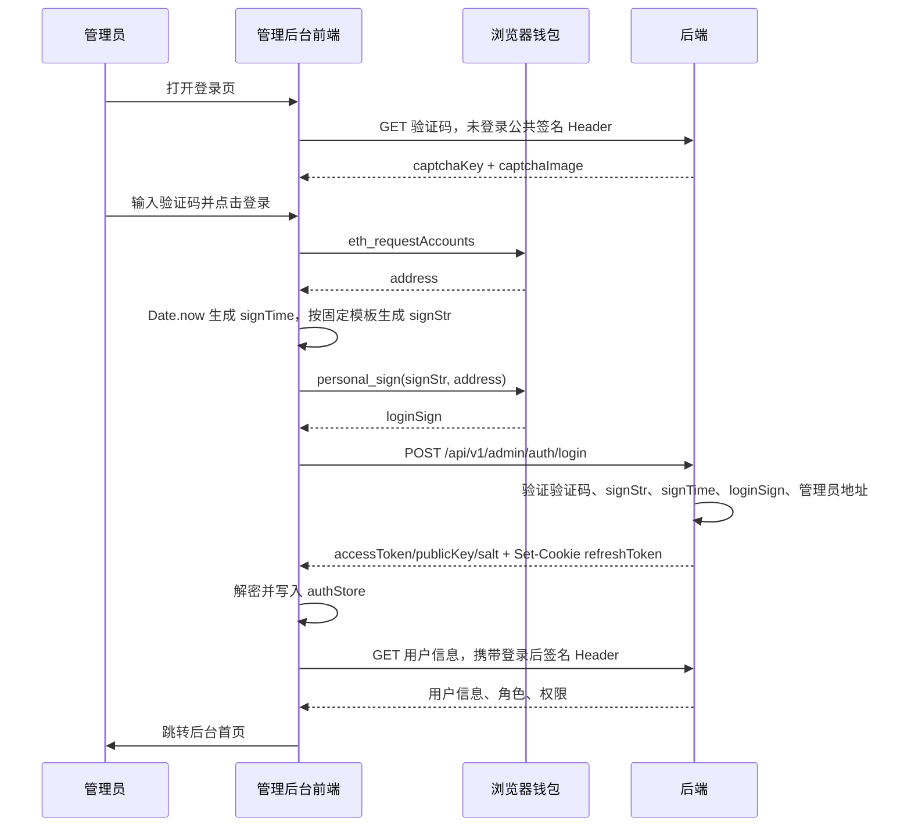

# 管理后台钱包签名登录改造方案

本文档基于 `base-java-wallet-spring-boot-4/docs` 下新增的钱包登录方案，给出 `base_manager_wallet_vue_3` 管理后台前端的改造方案。

参考来源：

- `base-java-wallet-spring-boot-4/docs/development/frontend-api-request-guide-wallet-login.md`
- `base-java-wallet-spring-boot-4/docs/development/captcha-usage-wallet-sign-login.md`
- `base-java-wallet-spring-boot-4/docs/database/captcha_math_wallet_signature_login.md`
- `base-java-wallet-spring-boot-4/docs/database/admin_permission_tables_wallet_login.md`

---

## 1. 改造目标

管理员登录由 `username/password + captcha` 改为 `wallet address + personal_sign + captcha`。

| 能力 | 当前前端 | 新方案 |
|------|----------|--------|
| 登录凭证 | `username/password` | `address/signTime/signStr/loginSign` |
| 人机校验 | 数学验证码 | 数学验证码继续保留 |
| 请求安全 | 已有签名模式：`X-Auth-*` Header | 保持复用，登录接口未登录态也要加公共签名 Header |
| Token | `accessToken/publicKey/salt` 已有加密存储能力 | 保持复用，Refresh Token 仍走 HttpOnly Cookie |
| 权限 | `uid + RBAC` | 保持不变，不用钱包地址做前端权限判断 |
| 管理员维护 | 用户名、密码、状态等 | 增加 `walletAddress` 展示、查询、保存、校验 |

不在本次前端方案范围内：

- 前端不实现链上交易、不请求私钥、不保存助记词。
- 前端不根据钱包地址决定菜单或按钮权限。
- 前端不负责管理员地址授权逻辑，只负责提交地址和签名；授权仍由后端 `admin_user.wallet_address` 判断。

---

## 2. 后端接口契约

### 2.1 登录接口

接口路径以新增后端文档为准：

```text
POST /api/v1/admin/auth/login
```

请求体：

```typescript
export interface AdminWalletLoginRequest {
  address: string
  signTime: number
  signStr: string
  loginSign: string
  device: string
  deviceType?: "web" | "app"
  captchaKey: string
  captchaAnswer: string
}
```

响应继续沿用当前登录响应：

```typescript
export interface AdminLoginResponse {
  accessToken: string
  accessExpiresIn?: number
  publicKey: string
  salt: string
  uid: number
  username?: string
}
```

注意：

- `accessToken/publicKey/salt` 如果后端仍使用 AES 加密传输，前端继续用 `aesBackendDecrypt(value, AP_KEY)` 解密后写入 `useAuthStore`。
- 登录请求必须继续走 `request` 拦截器，未登录态 `X-Auth-Token` 为空字符串，并使用 `DEFAULT_PUBLIC_KEY/DEFAULT_SALT` 生成公共签名 Header。
- 登录请求必须 `withCredentials: true`，确保后端 `Set-Cookie` 下发 HttpOnly Refresh Token。

### 2.2 验证码接口

后端钱包登录文档中给出的验证码路径存在两个候选：

```text
GET /api/admin/auth/captcha
GET /api/public/captcha
```

当前 `base_manager_wallet_vue_3/src/api/auth-api.ts` 使用的是：

```text
GET /api/public/captcha
```

前端改造时建议保留一个环境配置或常量集中管理验证码路径，联调时按后端最终开放路径调整。验证码请求也应作为未登录请求加公共签名 Header。

### 2.3 签名文本

前端必须完全复用后端模板，不额外 `trim` 或格式化：

```typescript
export function buildAdminLoginSignText(address: string, signTime: number, uri: string) {
  return [
    "TJT Admin wants you to sign in with your account:",
    address,
    "",
    "Sign in with account to the admin console.",
    "",
    `URI: ${uri}`,
    `Login time: ${signTime}`,
  ].join("\n")
}
```

关键约束：

- `address` 必须是当前钱包地址。
- `signTime` 使用毫秒时间戳，即 `Date.now()`。
- `uri` 必须与后端配置一致，建议默认取 `window.location.origin`，如后端使用固定管理端域名，则前端通过 `VITE_ADMIN_LOGIN_SIGN_URI` 注入。
- 后端建议 60 秒有效期，前端每次点击登录都重新生成 `signTime/signStr/loginSign`。

---

## 3. 当前前端现状

当前项目已经具备以下基础能力，可以直接复用：

- `src/api/auth.ts`、`src/api/sign-auth.ts`：请求签名 Header 生成。
- `src/utils/request.ts`：签名模式、`withCredentials`、401 刷新、并发刷新。
- `src/store/modules/auth.ts`：`accessToken/publicKey/salt/deviceId` 加密存储。
- `src/utils/crypto.ts`、`src/utils/rsa.ts`：AES/RSA 工具。
- `src/api/constants.ts`：`DEFAULT_PUBLIC_KEY/DEFAULT_SALT/AP_KEY`。

当前仍需要替换的账号密码登录点：

- `src/types/api/auth.ts`：`LoginRequest` 仍以 `username/password` 为主。
- `src/api/auth-api.ts`：`AuthAPI.login()` 仍组装 `username/password`。
- `src/composables/useLoginForm.ts`：仍维护账号、密码、记住我、验证码。
- `src/views/login/components/Login.vue`：仍展示用户名和密码输入框。
- `src/store/modules/user.ts`：`login()` 仍按旧 `LoginRequest` 入参调用。
- `src/types/api/admin-user.ts`、`src/views/system/user/*`：管理员用户维护尚未包含 `walletAddress`。

---

## 4. 文件级改造方案

### 4.1 新增钱包签名工具

建议新增：

```text
src/utils/wallet.ts
```

职责：

- 检测 `window.ethereum`。
- 连接钱包并读取当前地址。
- 监听 `accountsChanged`、`chainChanged`，账号变化时清理旧登录态或提示重新登录。
- 生成管理员登录签名文本。
- 调用钱包签名，返回 `address/signTime/signStr/loginSign`。

推荐类型：

```typescript
export interface AdminWalletSignPayload {
  address: string
  signTime: number
  signStr: string
  loginSign: string
}
```

推荐实现策略：

- 轻依赖方案：直接使用 `window.ethereum.request({ method: "eth_requestAccounts" })` 与 `personal_sign`，不新增依赖。
- SDK 方案：新增 `ethers`，使用 `BrowserProvider` 和 `signer.signMessage(signStr)`。如果团队已有 Web3 工具链偏好，可改用 `viem`。

轻依赖示例：

```typescript
export function buildAdminLoginSignText(address: string, signTime: number, uri: string) {
  return [
    "TJT Admin wants you to sign in with your account:",
    address,
    "",
    "Sign in with account to the admin console.",
    "",
    `URI: ${uri}`,
    `Login time: ${signTime}`,
  ].join("\n")
}

export async function signAdminLoginMessage(uri: string): Promise<AdminWalletSignPayload> {
  const ethereum = window.ethereum
  if (!ethereum) throw new Error("WALLET_NOT_FOUND")

  const accounts = (await ethereum.request({ method: "eth_requestAccounts" })) as string[]
  const address = accounts[0]
  if (!address) throw new Error("WALLET_ADDRESS_EMPTY")

  const signTime = Date.now()
  const signStr = buildAdminLoginSignText(address, signTime, uri)
  const loginSign = (await ethereum.request({
    method: "personal_sign",
    params: [signStr, address],
  })) as string

  return { address, signTime, signStr, loginSign }
}
```

同时补充全局类型：

```text
src/types/global.d.ts
```

增加 `window.ethereum` 的最小类型声明，避免 TypeScript 报错。

### 4.2 修改认证类型

修改：

```text
src/types/api/auth.ts
```

将账号密码登录请求替换为钱包登录请求：

```typescript
export interface AdminWalletLoginRequest {
  address: string
  signTime: number
  signStr: string
  loginSign: string
  device: string
  deviceType?: "web" | "app"
  captchaKey: string
  captchaAnswer: string
}

export type LoginRequest = AdminWalletLoginRequest
```

如果需要灰度兼容账号密码，可拆成两个类型：

```typescript
export interface PasswordLoginRequest {
  username: string
  password: string
  captchaKey?: string
  captchaAnswer?: string
  device?: string
  deviceType?: string
}
```

并通过 `VITE_USE_WALLET_LOGIN=true/false` 控制登录 UI 和 API 分支。若后端已经明确下线密码登录，建议不要保留双入口，减少安全和测试成本。

### 4.3 修改认证 API

修改：

```text
src/api/auth-api.ts
```

`AuthAPI.login()` 不再接收或提交 `username/password`：

```typescript
async login(data: AdminWalletLoginRequest) {
  const response = await request<any, LoginResponse>({
    url: "/api/v1/admin/auth/login",
    method: "post",
    data,
    headers: { Authorization: NO_AUTH_HEADER_VALUE },
    withCredentials: true,
  })

  return {
    ...response,
    accessToken: aesBackendDecrypt(response.accessToken, AP_KEY),
    publicKey: aesBackendDecrypt(response.publicKey, AP_KEY),
    salt: aesBackendDecrypt(response.salt, AP_KEY),
  }
}
```

刷新接口建议同步为 HttpOnly Cookie 模式：

```typescript
refreshToken(device: string) {
  return request<any, LoginResponse>({
    url: "/api/v1/admin/auth/token/refresh",
    method: "post",
    data: { device },
    headers: { Authorization: NO_AUTH_HEADER_VALUE },
    withCredentials: true,
  })
}
```

若当前 `src/utils/request.ts` 已通过 `VITE_APP_AUTH_REFRESH_PATH` 统一刷新，则 `AuthAPI.refreshToken()` 可以只保留兼容分支，避免两个刷新入口逻辑分裂。

### 4.4 修改登录组合逻辑

修改：

```text
src/composables/useLoginForm.ts
```

状态改为：

```typescript
const loginFormData = ref({
  captchaKey: "",
  captchaAnswer: "",
})

const walletAddress = ref("")
const walletConnecting = ref(false)
const signing = ref(false)
```

校验规则只保留验证码必填；签名前先校验验证码，避免用户签名后才发现验证码缺失。

提交流程：

```text
1. 表单校验 captchaAnswer
2. 调用 signAdminLoginMessage(signUri)，触发钱包连接和签名
3. 组装 AdminWalletLoginRequest
4. userStore.login(payload)
5. 登录成功跳转 redirect
6. 任意失败刷新验证码
```

错误处理建议：

| 场景 | 前端行为 |
|------|----------|
| 未安装钱包 | 提示安装 MetaMask 或兼容钱包 |
| 用户拒绝连接 | 停留登录页，不调用登录接口 |
| 用户拒绝签名 | 停留登录页，不调用登录接口 |
| `CAPTCHA_INVALID` | 刷新验证码，清空答案 |
| `LOGIN_SIGN_EXPIRED` | 提示重试并重新签名 |
| `LOGIN_SIGN_INVALID` | 提示签名校验失败，刷新验证码 |
| `ADMIN_ADDRESS_NOT_FOUND` | 提示当前钱包未授权登录后台 |
| `USER_DISABLED/ACCOUNT_LOCKED` | 展示后端错误文案 |

### 4.5 修改登录组件

修改：

```text
src/views/login/components/Login.vue
```

UI 调整：

- 删除用户名输入框、密码输入框、忘记密码入口。
- 保留验证码输入和验证码图片。
- 增加钱包连接状态展示：未连接、已连接短地址、签名中。
- 登录按钮文案改为“连接钱包并登录”。
- 若已连接钱包，可展示短地址 `0x1234...5678`，但按钮仍每次登录时重新签名。

推荐按钮状态：

| 状态 | 按钮 |
|------|------|
| 正常 | 连接钱包并登录 |
| 钱包连接中 | 连接钱包中... |
| 等待签名 | 请在钱包中确认 |
| 登录请求中 | 登录中... |

### 4.6 修改用户 Store

修改：

```text
src/store/modules/user.ts
```

`login()` 入参改为 `AdminWalletLoginRequest`。签名模式下继续写入 `useAuthStore`：

```typescript
const res = await AuthAPI.login(payload)
useAuthStore(store).setAuth({
  accessToken: res.accessToken,
  publicKey: res.publicKey || DEFAULT_PUBLIC_KEY,
  salt: res.salt || DEFAULT_SALT,
})
await getUserInfo({
  token: res.accessToken,
  salt: res.salt || DEFAULT_SALT,
  publicKey: res.publicKey || DEFAULT_PUBLIC_KEY,
})
```

`doRefreshToken()` 建议不再读取 `AuthStorage.getRefreshToken()`，因为新方案 refreshToken 由 Cookie 管理：

```typescript
const { accessToken, publicKey, salt } = await AuthAPI.refreshToken(useAuthStore(store).deviceId)
useAuthStore(store).updateTokens({ accessToken, publicKey, salt })
```

如果 `src/utils/request.ts` 已经统一处理签名模式刷新，`userStore.refreshTokenOnce()` 只需要保留 Bearer 兼容分支。

### 4.7 修改管理员用户管理

后端新方案要求 `admin_user.wallet_address` 作为管理员登录地址，前端管理页面需要支持维护。

修改：

```text
src/types/api/admin-user.ts
src/views/system/user/index.vue
src/views/system/user/components/UserTable.vue
src/views/system/user/components/UserSearch.vue
src/views/system/user/components/UserDialog.vue
src/composables/useAdminUserList.ts
src/composables/useAdminUserFormDialog.ts
src/api/system/user.ts
```

建议字段命名以前端驼峰为准：

```typescript
walletAddress?: string
```

接口层如后端返回下划线字段，则统一做一层适配：

```typescript
walletAddress: item.walletAddress ?? item.wallet_address
```

页面改造：

- 列表增加“钱包地址”列，展示短地址，悬浮或复制按钮提供完整地址。
- 查询条件增加钱包地址精确或模糊查询，按后端能力决定。
- 新增/编辑管理员增加钱包地址输入框。
- 校验钱包地址兼容 EVM 与 Solana：EVM 使用 `/^0x[a-fA-F0-9]{40}$/`；Solana 可按 Base58 且长度 32-44 校验，如 `/^[1-9A-HJ-NP-Za-km-z]{32,44}$/`。
- 保存前按链类型规范化：EVM 地址可统一转小写；Solana Base58 地址区分大小写，不能强制转小写。
- 密码字段改为灰度兼容：钱包登录稳定后，新增/编辑不再强制填写密码。

### 4.8 国际化与文案

修改：

```text
src/lang/package/zh-cn.json
src/lang/package/en.json
```

新增文案：

- `login.connectWalletAndLogin`
- `login.walletNotFound`
- `login.walletRejected`
- `login.walletUnauthorized`
- `login.signExpired`
- `login.signInvalid`
- `login.connectedWallet`
- `login.waitWalletSignature`
- `system.user.walletAddress`

若项目短期只服务中文后台，也可以先在组件内使用中文文案，但建议最终沉淀到 i18n 文件。

---

## 5. 登录时序



---

## 6. 安全与兼容策略

### 6.1 必须遵守

- 登录签名文案与后端模板完全一致。
- 每次登录重新签名，不缓存 `loginSign`。
- 登录失败后刷新验证码。
- 前端不保存私钥、不要求用户输入助记词。
- 前端不根据钱包地址做权限判断。
- 生产环境使用 HTTPS。
- `VITE_USE_SIGN_AUTH=true` 时所有接口都走 `X-Auth-*` 签名 Header。

### 6.2 建议增加环境变量

```env
VITE_USE_WALLET_LOGIN=true
VITE_ADMIN_LOGIN_SIGN_URI=
VITE_APP_ADMIN_LOGIN_PATH=/api/v1/admin/auth/login
VITE_APP_CAPTCHA_PATH=/api/public/captcha
```

说明：

- `VITE_USE_WALLET_LOGIN`：控制是否启用钱包登录 UI。后端完全切换后可移除。
- `VITE_ADMIN_LOGIN_SIGN_URI`：为空时默认 `window.location.origin`。
- `VITE_APP_ADMIN_LOGIN_PATH`：避免登录路径散落在代码里。
- `VITE_APP_CAPTCHA_PATH`：适配后端最终验证码路径。

---

## 7. 分阶段实施计划

### 阶段一：认证链路改造

1. 新增 `src/utils/wallet.ts` 与 `window.ethereum` 类型声明。
2. 修改 `src/types/api/auth.ts`，增加 `AdminWalletLoginRequest`。
3. 修改 `src/api/auth-api.ts`，登录 payload 改为钱包签名字段。
4. 修改 `src/composables/useLoginForm.ts`，签名前先校验验证码。
5. 修改 `src/views/login/components/Login.vue`，替换账号密码 UI。
6. 修改 `src/store/modules/user.ts`，移除签名模式下 refreshToken 明文依赖。

验收：

- 未登录验证码请求正常。
- 钱包连接、签名、登录接口调用正常。
- 登录成功后 `auth_credentials` 仅存加密凭证。
- 后续用户信息、菜单、权限接口携带登录后 `X-Auth-*` Header。

### 阶段二：管理员地址维护

1. `AdminUserListItem/AdminUserSaveRequest` 增加 `walletAddress`。
2. 管理员列表展示钱包地址，支持复制完整地址。
3. 管理员新增/编辑表单增加钱包地址字段，并支持 EVM 与 Solana 地址校验。
4. 查询表单增加钱包地址筛选。
5. 与后端确认密码字段是否保留灰度兼容。

验收：

- 可创建或编辑管理员钱包地址。
- 地址格式错误无法提交。
- 列表可看到已绑定地址。
- 使用未绑定钱包登录时后端返回未授权错误，前端提示清晰。

### 阶段三：清理账号密码兼容

1. 移除登录页账号、密码、忘记密码相关文案和逻辑。
2. 清理 `PasswordLoginRequest`、`AuthStorage.refreshToken` 等旧兼容逻辑，前提是后端已不再支持密码登录。
3. 更新单元测试和文档索引。

验收：

- 代码中不再出现登录页使用的 `username/password`。
- Refresh Token 不再写入 localStorage/sessionStorage。
- 路由守卫、登出、401 跳转仍正常。

---

## 8. 测试清单

### 单元测试

- `buildAdminLoginSignText()` 输出必须与后端模板完全一致。
- 钱包地址短地址格式化。
- EVM 与 Solana 地址格式校验。
- `AuthAPI.login()` payload 不包含 `username/password`。
- `useAuthStore` 写入和读取凭证仍能正常解密。

### 联调测试

- 未安装钱包提示。
- 拒绝连接钱包。
- 拒绝签名。
- 验证码错误后刷新验证码。
- 签名超时后重新签名。
- 未绑定钱包地址无法登录。
- 禁用或锁定管理员无法登录。
- 登录成功后刷新页面仍保持当前标签页登录态。
- 关闭标签页后 sessionStorage 凭证失效。
- Access Token 过期后自动刷新并重试原请求。
- Refresh Token 失效后清理凭证并跳转登录页。

### 安全回归

- 浏览器存储中不存在 refreshToken 明文。
- 浏览器存储中不存在私钥、助记词、签名明文缓存。
- 登录接口请求 Header 中有 `X-Auth-Token/X-Auth-Timestamp/X-Auth-Sign/X-Auth-Nonce/X-Auth-Device`。
- 前端权限仍来自后端菜单、角色、权限码，不从钱包地址派生。

---

## 9. 关键风险

| 风险 | 影响 | 应对 |
|------|------|------|
| 前后端 `URI` 不一致 | 后端重建 `signStr` 后比对失败 | 使用 `VITE_ADMIN_LOGIN_SIGN_URI` 与后端配置同步 |
| `personal_sign` 参数顺序钱包兼容性差异 | 某些钱包签名失败 | 首选 `ethers.signer.signMessage` 或封装适配不同钱包 |
| 登录失败验证码被消费 | 用户重复失败 | 每次失败后自动刷新验证码 |
| 账号密码旧逻辑残留 | 认证入口不一致 | 分阶段清理并补测试 |
| 后端验证码路径未统一 | 登录页取不到验证码 | 用环境变量配置路径，联调后固化 |
| 管理员地址大小写 | Solana 地址被错误转小写会导致地址失效 | 按链类型规范化：EVM 可小写，Solana 保留原值；后端查询使用同一规范化策略 |

---

## 10. 推荐落地顺序

优先顺序：

1. 先完成登录链路：钱包连接、签名、提交、Token 存储、用户信息拉取。
2. 再完成管理员钱包地址维护页面，保证后台可以配置可登录地址。
3. 最后清理账号密码兼容分支和旧文案。

这样可以先跑通最短闭环：后端初始化一个已绑定 `wallet_address` 的管理员，前端用该钱包签名登录，登录成功后继续复用现有 RBAC 菜单和按钮权限。
